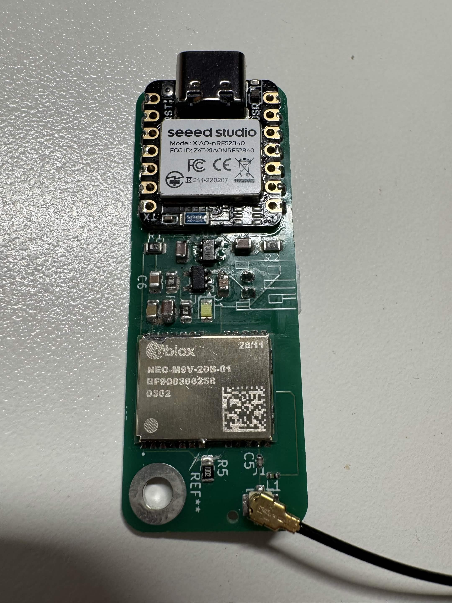

# Aevia

Aevia is a DIY, battery powered lap timer and track data logger. The current hardware is the V2 Mini, a compact board that combines multi-band GNSS, a 6-axis IMU, local storage, a display interface, physical controls, and wireless connectivity.

Uses very very high end sensors, UM980, SCH16T-K01

The goal is to build something in the same general space as a Garmin Catalyst, but at a lower cost and with more control over the hardware, raw data, and software. Recorded data should also remain useful outside the device, with export to proper desktop analysis tools.

## V2 Mini hardware

The V2 Mini is built around:

- `ESP32-S31-WROOM-3-N16R16V` as the main processor and radio
- `UM980` multi-band, multi-constellation GNSS receiver
- `SCH16T-K01-1` 6-axis accelerometer and gyroscope
- microSD storage over 4-bit SDIO
- a 24-pin SPI display interface for the Adafruit 4520
- four UI buttons and four RGB status LEDs
- native USB data and USB-C power
- a 1-cell battery charger, fuel gauge, and push-button power control

See [v2_mini_design.md](./v2_mini_design.md) for the block diagrams, power tree, fitted parts, and current one-off build estimate.

## Firmware and software plan

The immediate work is hardware bring-up and the basic firmware needed to read the GNSS and IMU, store sessions on the microSD card, and exercise the display and controls. The application backlog currently looks like this.

### High priority

- [ ] Delta T lap timing with colour coding
- [ ] Raw-data analysis that can support lap times reported to 0.001 seconds and show the limits of the hardware
- [ ] Export to Harry's LapTimer or another tool that accepts the recorded data

### Medium priority

- [ ] G-G diagram, with filtering suitable for noisy IMU output
- [ ] Automatic track detection
  - [ ] Track learning mode
  - [ ] Manual start and finish line setup
- [ ] Smart battery management
- [ ] Theoretical best lap time
- [ ] Automatic recording based on acceleration
- [ ] Sector splits for tracks that support them

### Low priority

- [ ] Configurable LED bar
- [ ] Customisable gauges
- [ ] Colour themes

### Stretch ideas

- [ ] CAN bus or OBD data logging for brake, throttle, and other vehicle data
- [ ] Bluetooth support through the ESP32
  - [ ] RTK corrections, with a target of roughly 50 Hz and centimetre-level positioning
  - [ ] Firmware updates over Bluetooth
- [ ] Action camera synchronisation

## Why the UM980

Of the modules considered, the UM980 is the best fit I found for raw GNSS quality at this price. It can output at 20 Hz while using multiple GNSS constellations. That matters in a car because an antenna inside the windscreen loses much of its view behind the metal roof. Combining GPS, GLONASS, Galileo, and BeiDou leaves more satellites available for each fix and can improve accuracy when the view of the sky is limited. A receiver advertised as "multi-GNSS" does not necessarily support its maximum update rate while using several constellations at once.

It also supports multiple frequency bands. A single-band receiver has a harder time separating a direct signal from one reflected by the car or nearby barriers. Comparing L1 with L2 or L5 gives the receiver more information for rejecting poor measurements.

The planned BT-T076 antenna is helical. It has lower peak gain than a ceramic patch, but it keeps better coverage when tilted and at low elevation. That is useful near the horizon, where a patch antenna mounted inside a car can struggle. Many common patch antennas are also L1-only.

The expected gain over a decent off-the-shelf logger is not enormous, and software quality will matter just as much as the receiver. For absolute lap-time proof, a track transponder still wins.

### Receivers considered

These figures are working notes from the module research and should be checked again before buying parts.

| Receiver | Notes |
|---|---|
| Unicore `UM980` | L1, L2/L5, and L6; multi-constellation; full RTK; 20 Hz with full multi-GNSS; about 50 Hz in RTK mode; roughly A$130 |
| u-blox `NEO-M9N` | L1-only; multi-constellation; 25 Hz with one constellation or 10 Hz with several; roughly A$20 |
| u-blox `NEO-M10S` | L1-only; multi-constellation; 25 Hz with one constellation or 10 Hz with several; roughly A$20 |
| u-blox `ZED-F9P` | L1 and L2; multi-constellation; full RTK; about 8 Hz with everything enabled or 20 Hz with a reduced configuration; roughly A$130 |
| Quectel `LC29H-DA/EA` | L1 and L5; multi-constellation; RTK on the EA variant; 10 Hz maximum |
| Septentrio `mosaic-X5` | All bands and constellations; the best raw quality in this comparison; capable of 100 Hz; more than A$1,000 |
| SkyTraq `PX1122R` | L1 and L2; multi-constellation RTK; apparently up to 20 Hz, although documentation and pricing were difficult to find |

The Dragy Pro was the only off-the-shelf product for which I could identify the receiver module. It uses a u-blox NEO-M10S and is listed in the research as 10 Hz with multiple constellations or 20 Hz with one. I have not found a module that clearly delivers 25 Hz, multi-GNSS, and 10 cm accuracy at the same time, so similar product claims are unlikely to be real.

The longer comparison is in [data/gps_module_research.md](./data/gps_module_research.md).
And raw GNSS modules specs are in [data/GNSS_research.xlsx](./data/GNSS_research.xlsx).

## Repository map

- [V2 Mini design notes](./v2_mini_design.md)
- [V2 Mini KiCad project](./hardware/v2_mini_pcb/v2_mini.kicad_pro)
- [V2 Mini root schematic](./hardware/v2_mini_pcb/v2_mini.kicad_sch)
- [V2 Mini PCB layout](./hardware/v2_mini_pcb/v2_mini.kicad_pcb)
- [V2 Mini production BOM](./hardware/v2_mini_pcb/production/digikey_bom.csv)
- [GNSS module research](./hardware/gps_module_research.md)
- [V1 PCB files](./hardware/v1_pcb/)
- [Earlier full-size V2 design notes](./v2_design.md)

## Building it

I do not recommend this as a first electronics build. Several parts need reflow equipment or a capable hot-air setup, and a one off board involves a fair amount of tooling and rework cost. The V2 Mini estimate is about $500AUD for the PCB, stencil, parts, GNSS receiver, antenna, and battery.

## V1 archive

archive, old, bad

