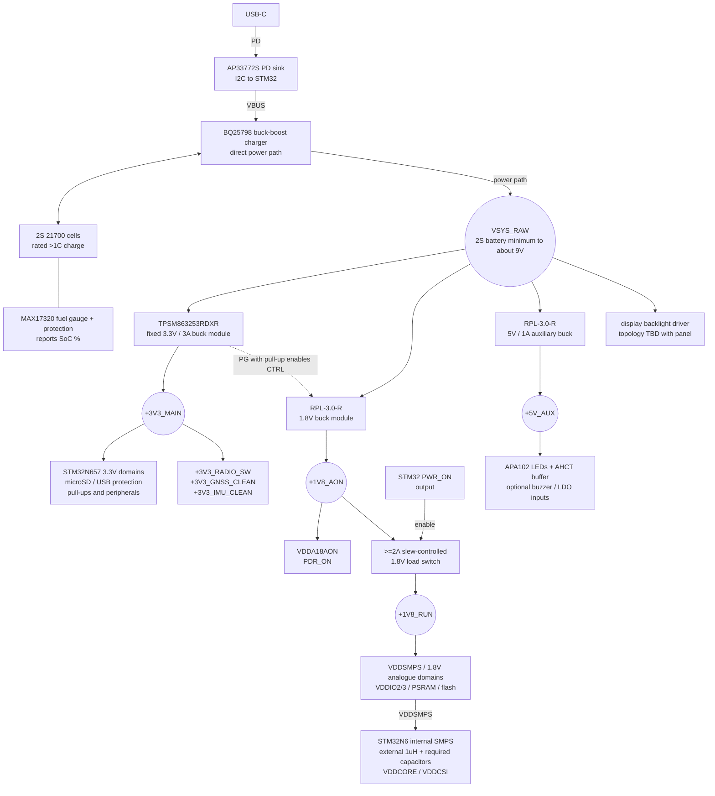

goal is to make a garmin catalyst2 but cheaper + better. Custom pcb better performance custom softare, still exporting to proper desktop tooling.

build pcb with this layout:
ESP+Power | Digital+STM+RAM | GNSS+IMU
left to right, have a cm or 2 between digital sensitive to reduce signal interference

check this pcb to see if bga is possible
https://www.st.com/en/evaluation-tools/stm32h7s78-dk.html#cad-resources

v2 pcb
- Needs to support
    - move to STM32N657X0H3Q
    - clocks:
        - HSE: NDK NX2016SA-24MHZ-EXS00A-CS10820
        - LSE: NDK NX2012SA-32.768KHZ-EXS00A-MU00527
    - flash (boot/code only, XIP — N6 is flashless, do NOT log data here):
        - MX66UW1G45GXDI00 - original octo spi, switch to cheaper quad spi flash under.
        - MX25U51279GXDR00
    - data storage (telemetry log, separate from boot flash):
        - microSD card via socket (Hirose DM3CS-SF), 3.3V, SDIO/SPI
    - external RAM for STM32N6
        - AP Memory APS512XXN-OB9-BG OPI/HPI PSRAM, 1.8V
        - verify the exact x16 ballout and repair the current VSS/data-pin net error before powering it
    - much faster battery charging, at least 1C
        - must have usb pd 
        - AP33772S pd controller, i2c
        - battery is 2s 21700 cells
        - BQ25798 charger provides the NVDC power path; 5A maximum charging does not mean a guaranteed 5A SYS load
        - MAX17320 to guage battery % and protection
            - NTC thermistor: NCP15XH103F03RC
        - downstream power system from the BQ25798 SYS pin
            - `VSYS_RAW`: unregulated BQ25798 system output; approximately the loaded 2S battery voltage with no input, and up to about 9V with an input/full battery
            - `+3V3_MAIN` @ 3A: TPSM863253RDXR fixed-output buck module
                - STM32N657 VDD/VBAT/VDD33USB and 3.3V I/O banks
                - microSD, USB-C protection power, pull-ups and general digital peripherals
                - ESP32-C6, GNSS and IMU use switched/filtered branches unless the final load budget requires another 3.3V converter
            - `+1V8_AON`: RPL-3.0-R buck module set to 1.8V; enabled by `+3V3_MAIN` power-good
                - directly powers STM32N657 VDDA18AON and PDR_ON
                - also feeds a >=2A, low-Ron, slew-controlled load switch
            - `+1V8_RUN`: output of the 1.8V load switch, enabled by the STM32 `PWR_ON` output
                - STM32 VDDSMPS, VDDA18PMU and the other run-time 1.8V analogue domains
                - VDDIO2/VDDIO3, APS512 PSRAM and MX25U51279 flash
                - STM32 internal SMPS then generates VDDCORE/VDDCSI; do not attach an external regulator to VDDCORE
            - `+5V_AUX` @ 1A: second RPL-3.0-R set to 5V while APA102 LEDs are fitted
                - APA102 LEDs, 5V AHCT clock/data buffer, optional buzzer and optional GNSS/IMU LDO inputs
                - validate 5V regulation at the minimum loaded battery voltage; use buck-boost if SYS can fall too close to 5V
            - display backlight driver connects to `VSYS_RAW`; topology/output TBD after selecting the panel and LED string
        - low-noise and switched branches
            - `+3V3_RADIO_SW`: load-switched branch of `+3V3_MAIN` for ESP32-C6; give the ESP supply at least 500mA capability
            - `+3V3_GNSS_CLEAN`: filtered branch of `+3V3_MAIN` by default, or LT3045EDD#TRPBF from `+5V_AUX` if ripple testing requires an LDO
            - `+3V3_IMU_CLEAN`: filtered branch of `+3V3_MAIN` by default, or TPS7A02 from `+5V_AUX` if a dedicated LDO is retained
    - Murata SCH16T-K01/K20 imu most ikelye K01, k20 not available yet easily
    - USB C protection - TI TPD8S300A
    - leds:
        - for on board small dev indicators, Lite-On LTST-C190
        - APA102-2020-256-8 for brighter LEDs; powered from `+5V_AUX` with an AHCT-family clock/data buffer
    - 5 inch 1000nit display maybe touchscreen?
        - use panelook.com
        - [search](https://www.panelook.com/modelsearch.php?op=advancedsearch&order=panel_id&inch_low=490&inch_high=680&signal_type_category=140&brightness_low=11501&sunlight_readable=1)
    - extra buttons
        - something super high quality and tactile?
    - extra leds
        - rgb smd
    - unicore um980 module
        - 20hz multi constellation spp fixes
        - 50hz rtk based fixes using 1hz spp. Rtk hard to work with? on standalone pcb not worth, probably need phone connection
        - maybe best in price range m10s and others dont have 20hz multi constellation, only single constellation, 
    - Antenna
        - Beitian BT-T076
    - buzzer, speaker probably overkill
    - esp32-c6 to handle bluetooth/wifi and smaller less important things like leds to save stm pins for important stuff
        - esp32-c6-mini-1
        - powered from `+3V3_RADIO_SW`, a load-switched/filtered branch of `+3V3_MAIN`
        - ability ot have random bluetooth sensors around the car? maybe not car very noisy
        - use this to run the leds
        - flashing over uart
    - deal with usb protection later
    - deal with debugging access later

### Power Tree

#### Rail budgets and implementation notes

| Net | Design target | Main loads |
|---|---:|---|
| `VSYS_RAW` | Battery/BQ power budget; approximately battery minimum to 9V | Inputs of the downstream converters and the backlight driver only |
| `+3V3_MAIN` | 3.3V, 3A | STM32 3.3V domains, microSD and general peripherals; filtered/switched ESP32, GNSS and IMU branches |
| `+1V8_AON` | 1.8V source for the complete 1.8V system | VDDA18AON/PDR_ON directly and the input of the RUN load switch |
| `+1V8_RUN` | 1.8V, 1.5A minimum / 2A preferred | STM32 VDDSMPS/analogue domains, VDDIO2/3, PSRAM and flash |
| `+5V_AUX` | 5V, 0.5A LEDs only / 1A shared | APA102 LEDs, level buffer, optional buzzer and optional clean-rail LDO inputs |
| Backlight output | TBD | Define after the display LED string is selected |

- Only `VSYS_RAW` is directly connected to the BQ25798 SYS pin. No logic device is powered directly from it.
- Battery-only `VSYS_RAW` approximately follows the pack, so its minimum is set by the loaded battery and BMS cutoff. With an input present it is controlled by the BQ25798 minimum-system/battery-following behaviour and can approach 9V for a full 2S pack. Use direct-SYS converters rated for at least 12V input; the selected modules are rated for 17V or 18V.
- `TPSM863253RDXR` integrates the 3.3V feedback network, bootstrap capacitor and inductor. Start with at least 10uF effective input capacitance and 22uF effective output capacitance; 44uF output is preferred for transient margin after DC-bias derating.
- `RPL-3.0-R` integrates its inductor. The 1.8V starting network is 10uF input, 22uF output, 47k/37.4k feedback, 22pF feed-forward and 1k sense. The 5V starting network uses 47k/8.87k and 39pF. Recalculate effective ceramic capacitance at operating bias.
- Use the open-drain TPSM863253 `PG` pin, pulled up to `+3V3_MAIN`, to drive the 1.8V RPL `CTRL` input. `PWR_ON` is an STM32 output and then enables the `+1V8_RUN` load switch.
- Keep the BQ25798-local SYS capacitor bank at its pins. Target the reference arrangement of five 10uF capacitors plus 100nF, using >=16V X5R/X7R parts and checking effective capacitance after DC bias.
- The selected regulator modules eliminate separate regulator inductors and compensation networks, but they do not replace the decoupling required at the STM32, RAM, flash, SD card, radio, GNSS or sensors.
- Complete the simultaneous peak-current, efficiency and thermal budget before layout freeze. The per-rail ratings are design limits and cannot all be treated as independently available from the BQ25798 at the same time.
- Do not create the old separate 3.3V LED and ESP buck rails unless final simultaneous-current or noise testing proves they are necessary. APA102 LEDs use `+5V_AUX`, not 3.3V. The UM980 itself uses 3.3V, not 5V.
- Stay in microSD 3.3V Default/High-Speed signalling mode for the lowest component count. SDR104 requires the proper 1.8V signalling switch/transceiver and is not obtained by simply moving the card supply to 1.8V.

Primary regulator references:

- [TPSM863253 product page](https://www.ti.com/product/TPSM863253)
- [RPL-3.0 datasheet](https://recom-power.com/pdf/Innoline/RPL-3.0.pdf)
- [BQ25798 datasheet](https://www.ti.com/lit/ds/symlink/bq25798.pdf)
- [STM32N6 hardware-development guide](https://www.st.com/resource/en/application_note/an5967-getting-started-with-hardware-development-for-stm32n6-mcus-stmicroelectronics.pdf)
