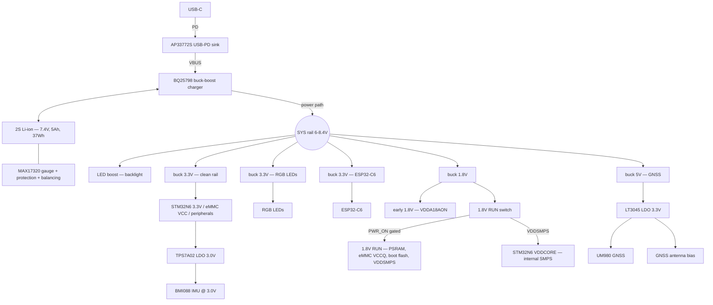

goal is to make a garmin catalyst2 but cheaper + better. Custom pcb better performance custom softare, still exporting to proper desktop tooling.

build pcb with this layout:
ESP+Power | Digital+STM+RAM | GNSS+IMU
left to right, have a cm or 2 between digital sensitive to reduce signal interference

check this pcb to see if bga is possible
https://www.st.com/en/evaluation-tools/stm32h7s78-dk.html#cad-resources

v2 pcb
- Needs to support
    - move to STM32N657X0H3Q
    - clocks:
        - HSE: NDK NX2016SA-24MHZ-EXS00A-CS10820
        - LSE: NDK NX2012SA-32.768KHZ-EXS00A-MU00527
    - flash (boot/code only, XIP — N6 is flashless, do NOT log data here):
        - MX66UW1G45GXDI00 - original octo spi, switch to cheaper quad spi flash under.
        - MX25U51279GXDR00
    - data storage (telemetry log, separate from boot flash):
        - KIOXIA THGBMNG5D1LBAIL 4GB eMMC 5.1, 153-ball FBGA
        - alt: Micron MTFC8GAKAJCN 8GB eMMC 5.1
    - extra ram for stm32h7
        - AP Memory APS512XXN-OB9-BG still need to pick speed grade to match XSPI clock
    - fast battery charging, 1C, USB-PD powered
        - AP33772S USB-PD sink, I2C to STM32 via level shifter, negotiate <=20V
        - battery: 2S Li-ion (2x 21700) or 2S LiPo, 7.4V, 5Ah, 37Wh, >=1C charge
        - BQ25798 buck-boost charger: single inductor + internal FETs, up to 5A, 3.6-24V VBUS, I2C, ADC, MPPT, power path to SYS
        - PD only needs ~45W (e.g. 15V/3A or 20V/2.25A)
        - MAX17320 at the pack: 2S gauge + protection + balancing, I2C SoC %
        - SYS is the 2S system rail (6.0-8.4V), set charger UVLO/min-system for 2S
        - point-of-load bucks off SYS (Vin up to 8.4V):
            - 3.3V @ 2A, clean rail (STM32N6 VDD/VDDA/VDD33USB, eMMC VCC, IMU LDO, peripherals) - TPS62130
            - 3.3V @ 2A, RGB LEDs - TPS62130
            - 3.3V @ 1A, ESP32-C6 - TPS62160
            - 1.8V @ 2A, base 1.8V rail (VDDA18AON early, then gate the 1.8V RUN branch via STM32 PWR_ON for PSRAM, eMMC VCCQ, boot flash, VDDIO banks, VDDSMPS) - TPS62913
            - 5V buck: GNSS LDO input + buzzer
            - LED boost for display backlight (pick after display)
        - ldos:
            - gnss LT3045EDD#TRPBF from 5V rail, output 3.3V to UM980 + antenna bias
            - imu TI TPS7A02 from 3.3V rail, output 3.0V to BMI088
    - BOSCH BMI088 imu
    - USB C protection - TI TPD8S300A
    - leds:
        - for on board small dev indicators, Lite-On LTST-C190
        - APA102-2020-256-8 for brigther led
    - 5 inch 1000nit display maybe touchscreen?
        - use panelook.com
        - [search](https://www.panelook.com/modelsearch.php?op=advancedsearch&order=panel_id&inch_low=490&inch_high=680&signal_type_category=140&brightness_low=11501&sunlight_readable=1)
    - extra buttons
        - something super high quality and tactile?
    - extra leds
        - rgb smd
    - unicore um980 module
        - 20hz multi constellation spp fixes
        - 50hz rtk based fixes using 1hz spp. Rtk hard to work with? on standalone pcb not worth, probably need phone connection
        - maybe best in price range m10s and others dont have 20hz multi constellation, only single constellation, 
    - Antenna
        - Beitian BT-T076
    - buzzer, speaker probably overkill
    - esp32-c6 to handle bluetooth/wifi and smaller less important things like leds to save stm pins for important stuff
        - esp32-c6-mini-1
        - ability ot have random bluetooth sensors around the car? maybe not car very noisy
        - use this to run the leds
        - flashing over uart
    - deal with usb protection later
    - deal with debugging access later

### Power Tree
