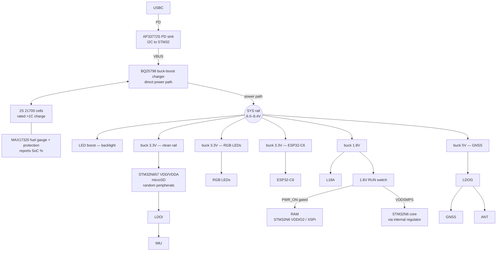

goal is to make a garmin catalyst2 but cheaper + better. Custom pcb better performance custom softare, still exporting to proper desktop tooling.

build pcb with this layout:
ESP+Power | Digital+STM+RAM | GNSS+IMU
left to right, have a cm or 2 between digital sensitive to reduce signal interference

check this pcb to see if bga is possible
https://www.st.com/en/evaluation-tools/stm32h7s78-dk.html#cad-resources

v2 pcb
- Needs to support
    - move to STM32N657X0H3Q
    - clocks:
        - HSE: NDK NX2016SA-24MHZ-EXS00A-CS10820
        - LSE: NDK NX2012SA-32.768KHZ-EXS00A-MU00527
    - flash (boot/code only, XIP — N6 is flashless, do NOT log data here):
        - MX66UW1G45GXDI00 - original octo spi, switch to cheaper quad spi flash under.
        - MX25U51279GXDR00
    - data storage (telemetry log, separate from boot flash):
        - microSD card via socket (Hirose DM3CS-SF), 3.3V, SDIO/SPI
    - extra ram for stm32h7
        - Infineon S80KS5122GABHV020 (HyperRAM), match speed grade to XSPI clock
    - much faster batteyr charging 1C atleast
        - must have usb pd 
        - AP33772S pd controller, i2c
        - battery is 2s 21700 cells
        - BQ25798 for charging privdes direct power path, 5a charging max
        - MAX17320 to guage battery % and protection
        - bucks/boosts off SYS rail
            - TPS63802: 3.3V @ 2A buck-boost, clean rail (STM32H7, eMMC VCC, UM980 LDO, IMU, touch, peripherals)
            - TPS62A02: 3.3V @ 2A buck, RGB LEDs
            - TPS63802: 3.3V @ 1A buck-boost, dedicated for ESP32-C6
            - TPS62A02: 1.8V @ 2A buck (PSRAM, eMMC VCCQ, VDDIO2/OCTOSPI)
            - 5V boost for buzzer (optional, TBD)
            - LED boost driver for display backlight (TBD, pick after display)
        - ldos:
            - gnss LT3045EDD#TRPBF
            - imu TI TPS7A02
    - Murata SCH16T-K01/K20 imu most ikelye K01, k20 not available yet easily
    - USB C protection - TI TPD8S300A
    - leds:
        - for on board small dev indicators, Lite-On LTST-C190
        - APA102-2020-256-8 for brigther led
    - 5 inch 1000nit display maybe touchscreen?
        - use panelook.com
        - [search](https://www.panelook.com/modelsearch.php?op=advancedsearch&order=panel_id&inch_low=490&inch_high=680&signal_type_category=140&brightness_low=11501&sunlight_readable=1)
    - extra buttons
        - something super high quality and tactile?
    - extra leds
        - rgb smd
    - unicore um980 module
        - 20hz multi constellation spp fixes
        - 50hz rtk based fixes using 1hz spp. Rtk hard to work with? on standalone pcb not worth, probably need phone connection
        - maybe best in price range m10s and others dont have 20hz multi constellation, only single constellation, 
    - Antenna
        - Beitian BT-T076
    - buzzer, speaker probably overkill
    - esp32-c6 to handle bluetooth/wifi and smaller less important things like leds to save stm pins for important stuff
        - esp32-c6-mini-1
        - ability ot have random bluetooth sensors around the car? maybe not car very noisy
        - use this to run the leds
        - flashing over uart
    - deal with usb protection later
    - deal with debugging access later

### Power Tree
