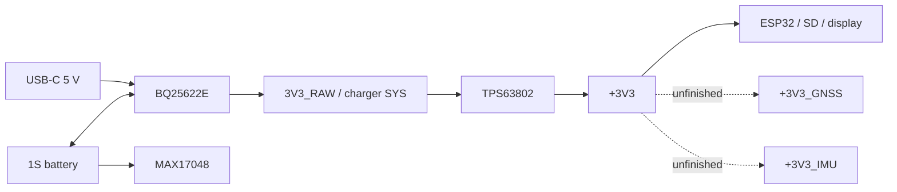

# Open Race V2 Mini

## Current design

- ESP32-S31-WROOM-3
- UM980 provides GNSS over two UARTs plus PPS and status signals.
- SCH16T-K01 provides IMU data over a dedicated SPI bus.
- microSD uses the ESP32 4-bit SDIO pins.
- The Adafruit 4520 display uses a separate SPI interface through its 24-pin FPC connector.
- USB-C supplies 5 V, carries native ESP32 USB Serial/JTAG, and has CC/data ESD protection.
- BQ25622E handles 1S charging and the power path.
- TPS63802 generates the 3.3 V system rail.
- MAX17048 is fitted for battery state-of-charge reporting.
- SW1 resets the ESP32 through `EN`; SW2 is the GPIO61 boot/user button.

## Main parts

| Ref | Function | Part in schematic |
|---|---|---|
| U2 | MCU, Wi-Fi, Bluetooth | ESP32-S31-WROOM-3 |
| U1 | GNSS | Unicore UM980 |
| U3 | IMU | SCH16T-K01-1 |
| U8 | 1S charger and power path | BQ25622ERYKR |
| U9 | Fuel gauge | MAX17048G_T10 |
| U10 | 3.3 V buck-boost | TPS63802DLAR |
| U6 | USB D+/D-/CC ESD | TPD4EUSB30 |
| J6 | USB-C | GCT USB4105-GF-A |
| J2 | microSD | Amphenol GTFP08441BEU |
| J3 | Adafruit 4520 display FPC | Amphenol SFV24R-2STE1HLF, 24-pin 0.5 mm bottom contact |

## Power

- BQ25622E uses L4 = 1 uH. TPS63802 uses L5 = 0.47 uH.
- TPS63802 feedback is 511 kOhm / 91 kOhm for 3.3 V.
- USB CC1 and CC2 each have a 5.1 kOhm `Rd`.
- TH1 is a 10 kOhm NTC in the charger temperature network.
- `QON` is currently unconnected. There is no charger wake button.
- BT1 and TH1 are schematic symbols; a physical battery/NTC connector is not yet defined.
- FB1 and FB2 are intended to feed the GNSS and IMU filtered rails, but their outputs are currently dangling. The sensor rails are not complete.

## ESP32 pin allocation

These are the nets drawn on the MCU sheet. Most peripheral nets are not yet joined across the top-level hierarchy.

| Interface | ESP32 pins / nets |
|---|---|
| Native USB | GPIO33 `USB_DN`, GPIO34 `USB_DP`, each through 22 ohm |
| USB-C CC sense | GPIO43 `USB_CC1`, GPIO45 `USB_CC2` |
| Power I2C | GPIO6 `POW_SCL`, GPIO7 `POW_SDA` |
| Charger/gauge status | GPIO0 `CHG_INT`, GPIO1 `CHG_STAT`, GPIO2 `BAT_ALRT` |
| IMU SPI | GPIO9 reset, 10 CS, 11 MOSI, 12 SCLK, 13 MISO, 14 DRDY |
| Display | GPIO4 backlight, 5 TE, 15 reset, 16 SCLK, 17 SDA, 18 CS, 19 D/C |
| microSD SDIO | GPIO20-23 D0-D3, GPIO24 CLK, GPIO25 CMD |
| GNSS UART 1 | GPIO46 `GNSS_TXD1`, GPIO47 `GNSS_RXD1` |
| GNSS UART 2 | GPIO48 `GNSS_TXD2`, GPIO49 `GNSS_RXD2` |
| GNSS control/status | GPIO42 PPS, GPIO44 reset, GPIO50 PVT, GPIO51 RTK, GPIO52 error |
| User button | GPIO61 to ground |
| Recovery UART | GPIO58 TX through 499 ohm to TP2; GPIO59 RX to TP1 |

## Peripheral notes

### GNSS

- U1 supply pins and four 10 uF capacitors plus one 100 nF bypass capacitor are on the local `VCC` net. That net does not yet have a completed source connection.
- Both UARTs, PPS, reset, PVT, RTK and error status are drawn.
- J1 is the coaxial antenna connector. C1, L1, C2, C3, C35 and D2 form the RF/bias/protection network.
- The antenna-bias node has no completed supply connection in the exported netlist.

### IMU

- U3 has dedicated SPI, data-ready and reset signals.
- Bypass network: 10 uF on VREGA, 1 uF on VREGD, and two 100 nF plus one 1 uF capacitor on the 3.3 V pins.

### Storage and display

- J2 is wired for 4-bit SDIO, not shared SPI. R19 is a 22 ohm series resistor on SD clock. Card detect is unused.
- The selected display is the bare [Adafruit 4520](https://www.adafruit.com/product/4520): 1.3-inch, 240 x 240 IPS, ST7789 controller and no breakout PCB.
- J3 is the matching Amphenol SFV24R-2STE1HLF 24-pin, 0.5 mm-pitch bottom-contact FPC connector.
- Display signals are `LCD_SCLK`, `LCD_SDA`, `LCD_CSN`, `LCD_DC`, `LCD_RN` and `LCD_TE`.
- Q1 is an N-MOS low-side backlight switch driven by `LCD_BACK`; R4 is 15 ohm and R5 is a 100 kOhm gate pulldown.
- The display has no touch interface.

## Layout priorities

- Put the ESP32 module antenna at a plastic enclosure edge and keep copper, battery, display metal and cables out of its antenna keepout.
- Keep the UM980 RF path short, 50 ohm and away from USB, SD/display clocks and both switching stages.
- Put the SCH16T on a rigid area away from USB, buttons, card insertion and regulator inductors.
- Keep the BQ25622E and TPS63802 switching loops tight with their capacitors and inductors on the same layer.
- Use continuous ground references. Do not split GNSS or IMU ground planes.
- Prove the board outline by placement before keeping any previous size target.

## JLCPCB STACKUP
`JLC06161H-3313`

## Notes
- SD card part does not need pullups [here](https://docs.espressif.com/projects/esp-hardware-design-guidelines/en/latest/esp32s31/schematic-checklist.html#sd-mmc-host-controller) says "When using slot0, the GPIO power domain is internally powered, so external pull-up resistors are not required"
