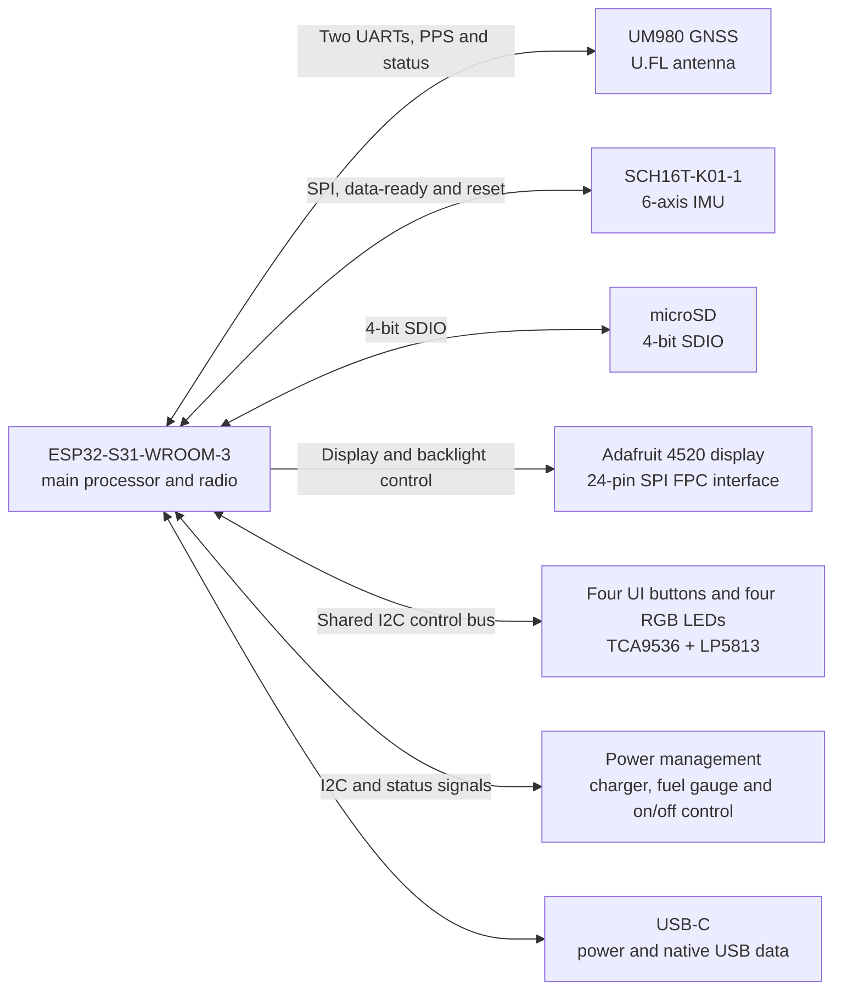
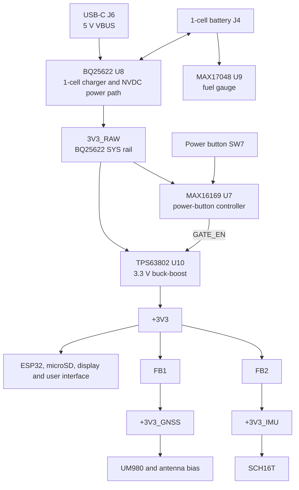

# Open Race V2 Mini

V2 Mini is a battery-powered GNSS and motion board built around the ESP32-S31 module. It has microSD storage, a display interface, physical controls, and native USB. Use the KiCad project and production BOM for build details. This page leaves out pin allocations, routing, and most passive components.

## High-level design

The ESP32 module handles processing, radio, and the board's main interfaces. The UM980 sends GNSS data over two UARTs and also has PPS, reset, and status connections. The SCH16T uses a separate SPI bus with data-ready and reset signals.

The microSD socket uses 4-bit SDIO. The selected display is the Adafruit 4520, connected through the 24-pin FPC with a MOSFET-switched backlight. The display panel itself is not a fitted PCB BOM item.

Four user buttons connect through the TCA9536 GPIO expander, and the LP5813 drives four RGB LEDs. Reset and boot/user connect directly to the ESP32. The power button connects to the MAX16169. The charger, fuel gauge, LED driver, and GPIO expander share the board's I2C control bus.

USB-C provides 5 V input and native USB data. The TPD4EUSB30 protects D+, D-, CC1, and CC2. The board also senses VBUS and both CC lines.

## Power tree

The schematic name `3V3_RAW` refers to the BQ25622 SYS rail. The TPS63802 turns it into the regulated `+3V3` system rail. FB1 and FB2 provide filtered supplies for the GNSS receiver and IMU.

The MAX16169 runs from the raw rail and controls the TPS63802 enable input. SW7 connects to its pushbutton input. Its interrupt output goes to the ESP32, and the ESP32 has a separate shutdown control back to it. The MAX17048 measures battery state of charge, while the BQ25622 handles charging and reports power-path status. TH1 is a fitted 10 kOhm NTC in the charger temperature-sense network.

The board expects a 1-cell battery with the matching 2-pin Hirose DF58 connection for J4. The PCB-side connector is `DF58-2P-1.2V(21)`.

## Main fitted parts

The part numbers below come from the production BOM rather than the shortened values shown on some schematic symbols.

| Ref | Ordered part | Purpose |
|---|---|---|
| U2 | `ESP32-S31-WROOM-3-N16R16V` | Main processor and wireless module |
| U1 | `UM980` | GNSS receiver |
| U3 | `SCH16T-K01-1` | 6-axis accelerometer and gyroscope |
| U4 | `LP5813ADRRR` | I2C RGB LED driver |
| U5 | `TCA9536ADTMR` | GPIO expander for the four UI buttons |
| U6 | `TPD4EUSB30DQAR` | USB data and CC ESD protection |
| U7 | `MAX16169AALTA+T` | Power-button and regulator-enable control |
| U8 | `BQ25622ERYKR` | 1-cell charger and NVDC power path |
| U9 | `MAX17048G+T10` | Battery fuel gauge |
| U10 | `TPS63802DLAR` | 3.3 V buck-boost regulator |
| D32-D35 | `MSL0402RGBU1` | Four RGB indicators |
| SW1-SW7 | `B3U-1000P` | Reset, boot/user, four UI buttons, and power |
| TH1 | `NCU18XH103F60RB` | 10 kOhm charger temperature sensor |
| J1 | `U.FL-R-SMT-1(01)` | GNSS antenna connector |
| J2 | `GTFP08441BEU` | microSD socket |
| J3 | `SFV24R-2STE1HLF` | 24-pin FPC connector for the Adafruit 4520 display |
| J4 | `DF58-2P-1.2V(21)` | 1-cell battery connector |
| J6 | `USB4105-GF-A` | USB-C connector |

## Hardware source files

- [Root schematic](pcb/v2_mini_pcb/v2_mini.kicad_sch)
- [PCB layout](pcb/v2_mini_pcb/v2_mini.kicad_pcb)
- [Production BOM](pcb/v2_mini_pcb/production/digikey_bom.csv)
- [BOM exclusions](pcb/v2_mini_pcb/production/bom_exclusions.csv)
